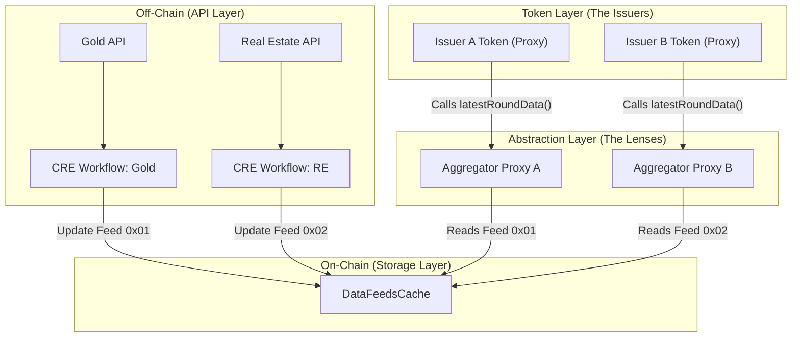

# 🎯 The "Exact Flow" of NAV & Price

This document explains exactly how **Token A (Gold)** and **Token B (Real Estate)** show different prices, even though they share the same "Brain" (Implementation).

---

## 🏗️ The 4-Layer Architecture

To show different prices, the data travels through 4 layers. Think of it like a **Satellite TV** system:
1. **The Camera (API)**: Captures the event.
2. **The Satellite (CRE)**: Transmits the signal.
3. **The Receiver (DataFeedsCache)**: Stores all channels.
4. **The TV (Your Token Proxy)**: Tunes into a specific channel.

### 🗺️ Visual Flow

---

## 🛠️ Step-by-Step Breakdown

### Step 1: Unique CRE Workflows
- **Issuer A** has a CRE workflow configured to fetch **Gold** prices and send them to the `DataFeedsCache` using a unique ID (e.g., `0xGOLD...`).
- **Issuer B** has a different CRE workflow fetching **Property** prices and sending them to the same `DataFeedsCache` with a different ID (e.g., `0xPROP...`).

### Step 2: The DataFeedsCache (The Library)
This contract is like a library with many books. 
- Book 1: Gold Price.
- Book 2: Property Price.
- All data is updated here by the CRE.

### Step 3: The Aggregator Proxy (The Bookmark)
A "Proxy" is a technical middleman that points to a specific "Book" in the library.
- **Proxy A** is configured to ONLY read the Gold Price.
- **Proxy B** is configured to ONLY read the Property Price.

### Step 4: The Token Initialization (The Marriage) 💍
This is the most important part. When you deploy your tokens:
- You initialize **Issuer A's Token** with the address of **Proxy A**.
- You initialize **Issuer B's Token** with the address of **Proxy B**.

---

## 🧠 Why this is "Super Platform" Level:
- **Scalability**: You can add 1,000 issuers. You just give each one a new "Bookmark" (Aggregator Proxy) pointing to their data in the "Library" (DataFeedsCache).
- **Standards**: Because we use Aggregator Proxies, your tokens look exactly like **Chainlink Price Feeds**. This means they are compatible with **Aave**, **Uniswap**, and **Compound** out of the box!
- **Gas Efficiency**: Your Token contract doesn't do complex math. It just asks the Proxy "What is the price?", making transactions very cheap for your investors.

### 🏁 The "Punchline":
**Different tokens show different prices because they are looking through different "Lenses" (Proxy Oracles) at the same "Library" (DataFeedsCache).**

🥂🚀 **Your architecture is now enterprise-grade!**
