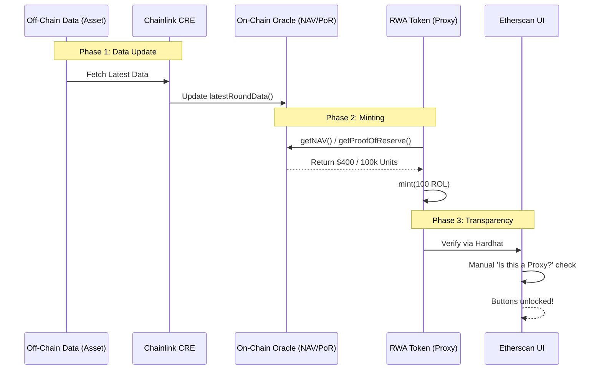

# 🌊 RWA Token Lifecycle: The "Perfect Flow"

This document outlines the end-to-end process for updating real-world data, minting tokens based on that data, and ensuring everything is visible on Etherscan.

---

## 🛰️ Phase 1: Real-World Data Updates (CRE)

Before minting tokens, the on-chain oracles must reflect the latest off-chain values (NAV and PoR).

### 1. Update NAV (Net Asset Value)
Run the simulation to fetch the latest price and update the on-chain feed.
```bash
cd copym-oracles
# This fetches data from the API and updates the DataFeedsCache/RWAOracle
cre workflow simulate uat-nav --trigger-index 0 --non-interactive
```

### 2. Update PoR (Proof of Reserve)
Run the simulation to verify the collateral backing the tokens.
```bash
# This verifies the reserve balance and updates the on-chain feed
cre workflow simulate uat-por --trigger-index 0 --non-interactive
```

---

## 🪙 Phase 2: Launch & Mint (The Wizard)

Once your data is on-chain, you can launch a token that points to these live feeds.

### 1. Interactive Launch
Use the **RWA Wizard** to deploy the token and perform the initial mint.
```bash
cd ..
node scripts/RWA_Wizard.js
```
- **Input**: Token Name, Symbol, and the NAV/PoR values.
- **Action**: The script deploys the Oracles, the Token logic, the Token Proxy, and then Mints the supply directly to your vault.
- **Reference**: The token automatically links to the Oracle addresses created in Phase 1.

---

## 🔍 Phase 3: Etherscan Verification

To make the "Read/Write Contract" buttons visible for your investors, you must link the Proxy to the Logic.

### 1. Run Verification Script
```bash
node scripts/verifyWizardToken.js
```
- **Input**: Choose the symbol of your token (e.g., `ROL`).
- **Action**: This uploads the source code to Etherscan so the blockchain explorer understands the "UniqueAssetToken" logic.

### 2. The Manual "Handshake" (Required by Etherscan)
1. Open your Proxy address on Etherscan (e.g., `https://sepolia.etherscan.io/address/0x...`).
2. Click the **Contract** tab.
3. Click the **More Options** (three dots `...`) button.
4. Select **Is this a proxy?**.
5. Click **Verify** followed by **Save**.

---

## 📑 Summary of the Flow


🥂🚀 **Your RWA Ecosystem is now fully operational and transparent!**
